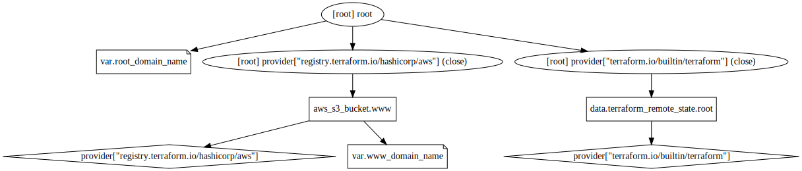

# Infrastructure

The infrastructure for [www.grocky.com](https://www.grocky.com)

## Infrastructure Graph

## Requirements

No requirements.

## Providers

| Name | Version |
|------|---------|
| aws | n/a |
| terraform | n/a |

## Inputs

| Name | Description | Type | Default | Required |
|------|-------------|------|---------|:--------:|
| root\_domain\_name | n/a | `string` | `"grocky.com"` | no |
| www\_domain\_name | n/a | `string` | `"www.grocky.com"` | no |

## Outputs

| Name | Description |
|------|-------------|
| cloudfront\_url | n/a |
| cloudfront\_www\_id | n/a |
| s3\_website\_url | n/a |
| site\_url | n/a |
